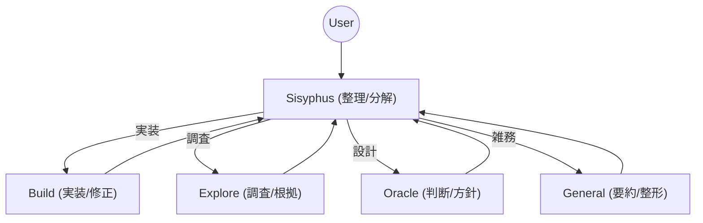

# Agent Definitions & Guidelines

このドキュメントは、opencode環境で稼働するエージェントの役割と運用指針をまとめた「人向けの入口」です。

## どのファイルが「設定の正」か

- 実行設定（モデル/ツール権限/モード）: `.devcontainer/opencode_config.json`
- ペルソナ/役割定義: `.oh-my-opencode/agents/*.md`
- 使い方・運用例: `README.md`

この `AGENTS.md` は上記設定の「読み物」として、概要・意図・運用のコツをまとめます。

## エージェント一覧

- **Sisyphus**: 入口・タスク分解・振り分け・統合
- **Build**: 実装・修正・差分作成・テスト
- **Explore**: Web調査・根拠付きの情報収集
- **Oracle**: 設計判断・トレードオフ整理・レビュー方針
- **General**: 要約・文章整形・オフィスワーク補助

## 役割フロー（概要）

## 使い分けの目安（ショートカット）

- `ocs` 迷ったら常にここ（全体整理と振り分け）
- `ocb` 具体的な実装や修正に集中したい時
- `ocg` 文章作成・要約・整形に集中したい時
- `oce` 公式情報の調査や根拠集めが必要な時
- `oco` 設計・方針・トレードオフ判断が必要な時

## コーディング中心の運用

- 入口は `Sisyphus`（要件整理・分解・振り分け）
- 実装は `Build`（差分作成、テスト、CLI操作）
- 仕様や根拠が必要な調査は `Explore`
- 設計判断やトレードオフ整理は `Oracle`

### バックエンド専任 / フロント専任の運用例

同じ `Build` でも文脈を分けて運用すると、切り替えコストが下がり効率が上がります。

- バックエンド担当: API設計、DB、認証、バッチ、パフォーマンス
- フロント担当: UI/UX、状態管理、アクセシビリティ、表示最適化

例:
- `ocs` でタスク分解 → `ocb` へ「バックエンド文脈で実装」と明示
- `ocs` でタスク分解 → `ocb` へ「フロント文脈で実装」と明示
- 仕様が曖昧な場合は `oco` で方針決定 → `ocb` に実装依頼

## オフィスワーク中心の運用

- 入口は `General`（要約、文章整形、議事録、メール下書き）
- 根拠付きの調査が必要な場合は `Explore`
- 組織ルールや方針判断が絡む場合は `Oracle`
- 事務作業の自動化やスクリプト化が必要な場合のみ `Build`

## エージェント定義ファイルへのリンク

- Sisyphus: `.oh-my-opencode/agents/sisyphus.md`
- Build: `.oh-my-opencode/agents/build.md`
- Explore: `.oh-my-opencode/agents/explore.md`
- Oracle: `.oh-my-opencode/agents/oracle.md`
- General: `.oh-my-opencode/agents/general.md`

